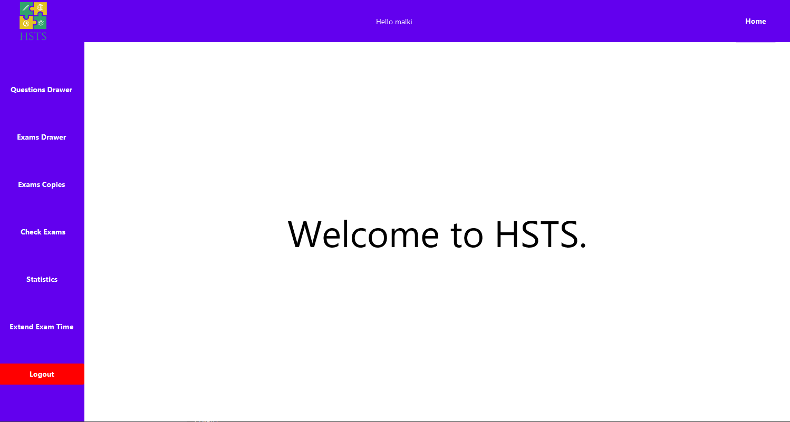
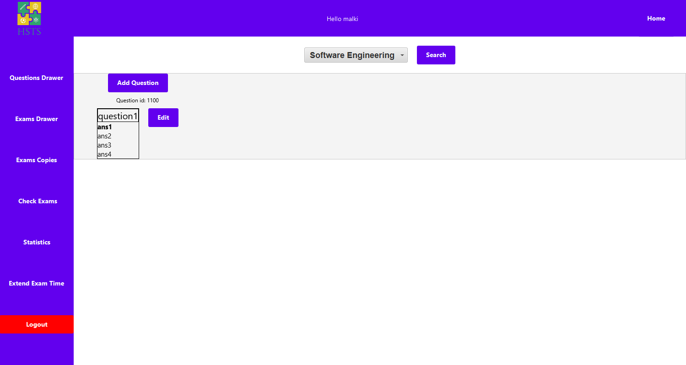
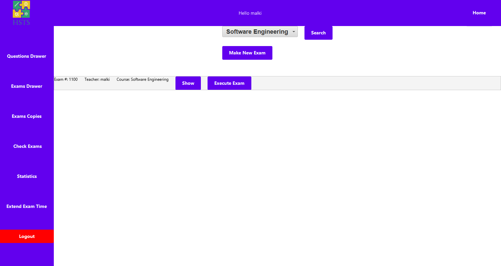

# High School Test System

**This is a project under the Software Engineering Course at the University of Haifa.**

***Final course grade: 95/100***

Lecturer: Dr. Malki Grossman

Teacher assistant: Mr. Liel Fridman

## _Team Members:_

> Waseem Tannous - Website: https://waseemtannous.com/
> 
> Saji Assi - Github: SajiAssi
>
> Farouq Krayem - Github: FarouqKrayem
>
> Morsy Biadsy - Github: MorsyB
>
> Rawad Khalayli - Github: rawadkh

**Technical analysis, documentation and system design and planning can be found under the 'documents' directory.**

### _Overview:_
This is a system for managing exams for a high school for students, teachers and the manager.

A student can login to his account and enter an exam and check his grade.

A teacher can add a question to the questions library which can be used by teachers to make and exams.

Exams are served in two ways: downloadable 'word' file or a digital exam taking place in the system.

When a student is done with his exam, the system will automatically mark it and will wait for the teacher to approve the grade.
The teacher can change the grade and give a written explaination for doing so.

Once the teacher approves all the grades, the system will build some statistic evaluation for the class.
Bar charts and pie charts are used. Number of students who finished during the given time and number of students who didn't.
The median and the average of all grades is also calculated.

The manager has the ability to freely look and examine all the information in the system.

## Screenshots:

